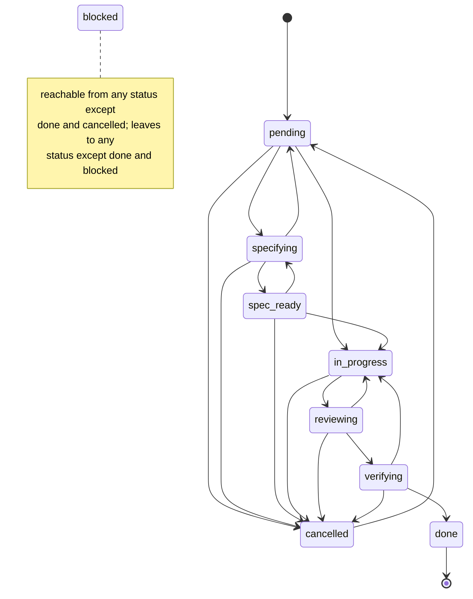
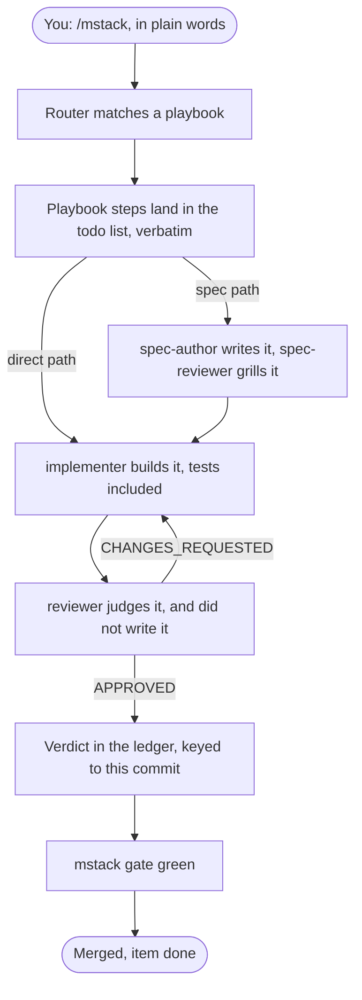
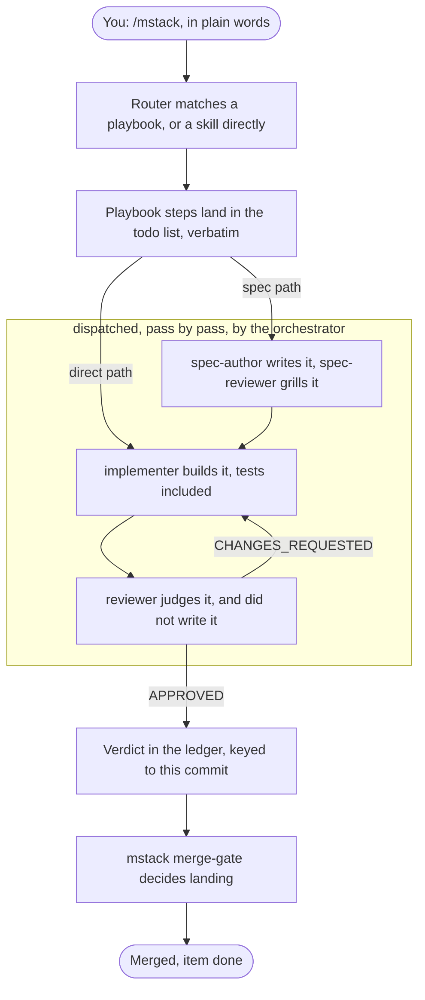

# Implementation - docs-for-newcomers (item 23)

## What changed

Two new wiki pages introduce the cast: `The-Agents.md` covers the five agents (purpose, when
each runs via the orchestrator's dispatch table, what each writes, what each must never do,
who records which ledger row, with pass separation as the thesis and a scratch-repo
transcript of the gate refusing an implementer-only close), and `Skills-and-Playbooks.md`
covers the twelve skills and seven playbooks in scannable tables, the router's route table,
the two paths in plain words, and a five-rung evidence-ladder summary that links State-Files
for depth. A readability layer went onto every existing content page: a 2-4 sentence
plain-language opening inserted after each H1, before the untouched first paragraph. Two
mermaid diagrams were added: a `stateDiagram-v2` of the lifecycle in How-A-Work-Item-Flows
above the transition table (blocked drawn as a note, per the recorded decision), and a
request-to-merged flowchart placed on Home.md (recorded decision: Home is the entry page and
the flow is orientation; Skills-and-Playbooks stays tables-first and links to it) and reused
verbatim in the README. The README top gained a plain paragraph and a "The map" section
(concept table plus the flowchart) before "Where this comes from". Home's pages table, the
README documentation table and `_Sidebar.md` list both new pages. Publishing-the-Wiki's
first `sd` rewrite command was extended with the two new filenames and both publish commands
were re-run on fresh copies to re-earn the page's "run and diffed" claim. No existing
sentence was reworded, split or deleted; every existing page is a pure addition except that
one re-run command.

## Files

- `docs/wiki/The-Agents.md` (new, 163 lines)
- `docs/wiki/Skills-and-Playbooks.md` (new, 107 lines)
- `docs/wiki/Home.md` (+28: opening paragraph, "One request, end to end" section, 2 table rows)
- `docs/wiki/How-A-Work-Item-Flows.md` (+41: opening paragraph, state diagram with lead-in)
- `docs/wiki/Getting-Started.md` (+6, opening paragraph only)
- `docs/wiki/The-Story.md` (+4, opening paragraph only)
- `docs/wiki/Gates-and-Hooks.md` (+6, opening paragraph only)
- `docs/wiki/The-CLI.md` (+5, opening paragraph only)
- `docs/wiki/State-Files.md` (+5, opening paragraph only)
- `docs/wiki/Status-Line.md` (+5, opening paragraph only)
- `docs/wiki/Publishing-the-Wiki.md` (+8 -2: opening paragraph, sd file list extended)
- `docs/wiki/_Sidebar.md` (+2)
- `README.md` (+40: plain paragraph, "The map" section with table and flowchart, 2 doc-table rows)
- `.mstack/progress/current.md`, `.mstack/decisions.tsv` (2 implement-phase rows)

## Commands

The item's verification field, run at the editing tree (full log in the session scratchpad,
`verify-run.log`):

```
$ npm test
Ran 276 tests across 15 files. [49.87s]        # bun test
ℹ tests 276                                    # node --test
ℹ pass 276
ℹ fail 0
$ npm run typecheck
> bunx --bun tsc --noEmit                      # no diagnostics
$ ./bin/mstack lint-plugin .
PASSED - 0 failures, 0 warnings
$ node scripts/check-doc-links.mjs README.md docs/wiki/*.md
91 relative links checked, 0 broken
chain exit: 0
```

Mermaid validation. The method: a script that imports `STATUSES` and `TRANSITIONS` from
`src/lifecycle.ts` and asserts the state diagram's edge set equals `TRANSITIONS` exactly
(blocked excluded, drawn as a note), all nine statuses appear verbatim, there is no
`in_progress -> done` edge, and both flowchart copies parse against mermaid arrow/node
grammar, stay under 15 nodes, and are byte-identical. Script at
`<scratchpad>/mermaid-check/check.ts`, run with bun:

```
$ bun <scratchpad>/mermaid-check/check.ts
ok    state diagram edges match TRANSITIONS exactly (18 edges, blocked via note)
ok    no in_progress -> done edge
ok    all 9 statuses appear verbatim
ok    Home.md: flowchart parses, 9 nodes, 10 edges
ok    README.md: flowchart parses, 9 nodes, 10 edges
ok    Home.md and README.md carry the identical flowchart
PASSED
```

Mutation check that the validator can fail (edge injected, then restored):

```
$ # after inserting "in_progress --> done" into the diagram
FAIL  edges in diagram not in lifecycle.ts: in_progress->done
FAIL  diagram has the forbidden in_progress -> done edge
FAILED: 2
mutated exit: 1
$ # after restoring
PASSED
restored exit: 0
```

The-Agents transcripts, produced in a scratch repository by this checkout's `./bin/mstack`
(setup, one item, implementer verdict, forced close, gate red; reviewer verdict, gate
green):

```
$ ./bin/mstack gate      # after the forced close on an implementer-only verdict
[fail]  items closed on a verdict from the pass that wrote the code: greet-flag (only implementer)
        fix: a closing verdict has to come from somewhere other than the implementer; run the verification again from a pass that did not write it
FAILED - 1 failure, 2 warnings
$ ./bin/mstack gate      # after the reviewer row at the same SHA
[ok]    1 closed item(s) carry a ledger verdict
PASSED - 0 failures, 2 warnings
```

Publishing-the-Wiki re-run: both sd commands executed on fresh copies of all fourteen pages
in the scratchpad; the result was compared per file against an independent Python transform
that rewrites links and nothing else:

```
independent transform matches sd output byte for byte
```

Byte-identity of existing content, against pre-edit byte copies:

```
$ diff <byte-copy> <page>   # per page; deletions would show as '<' lines
README.md: +40 -0 · Home.md: +28 -0 · How-A-Work-Item-Flows.md: +41 -0
Getting-Started.md: +6 -0 · The-Story.md: +4 -0 · Gates-and-Hooks.md: +6 -0
The-CLI.md: +5 -0 · State-Files.md: +5 -0 · Status-Line.md: +5 -0
Publishing-the-Wiki.md: +8 -2 (the sd command, re-run) · _Sidebar.md: +2 -0 · _Footer.md: +0 -0
```

Em-dash check over every added line: no matches.

## Acceptance to evidence

Docs item, so acceptance bullets map to checks rather than unit tests.

| Acceptance | Evidence | Rung |
|---|---|---|
| A1: five agents, twelve skills, seven playbooks documented, consistent with `agents/*.md` and `skills/*/SKILL.md` at this commit | `docs/wiki/The-Agents.md` (cast table, dispatch table, per-agent sections, ledger-row table), `docs/wiki/Skills-and-Playbooks.md` (12-skill table, route table, 7-playbook table). Written from the source files read this session; tool lists, report-name grammar and verdict mappings quoted from `agents/*.md`, skill sentences from each `SKILL.md` frontmatter | 2 (content claims traced to source lines); the two embedded gate transcripts are rung 4 |
| A2: lifecycle and request-flow mermaid diagrams that render on GitHub | State diagram in `How-A-Work-Item-Flows.md`, flowchart in `Home.md` and `README.md`. Edge/status match against `src/lifecycle.ts` and grammar checks: validator output above, plus mutation check | 4 for the lifecycle match and syntax well-formedness; **2 for GitHub rendering itself** (GitHub documents mermaid support for these diagram types, but no render was observed on GitHub this session; check on the PR view) |
| A3: every content page and the README top open plain before mechanism, README first screen maps concepts | Opening paragraphs inserted after each H1 on all 10 content pages (diff summary above shows insertions before untouched bodies); README lines 5-10 plain paragraph, "The map" table at lines 19-33 | 2 (structural, verifiable by reading the diffs) |
| A4: pasted output from real `./bin/mstack` runs at the editing commit; existing transcripts unaltered | New transcripts produced in the scratch repo by this checkout's `./bin/mstack` (runs shown above). Unaltered: per-page diffs show zero deleted lines on every page except the re-run sd command | 4 (the runs, and the diff check) |
| A5: check-doc-links and lint-plugin pass; `Home.md` and `_Sidebar.md` list every page | `91 relative links checked, 0 broken`; lint-plugin `PASSED - 0 failures, 0 warnings`; Home pages table and `_Sidebar.md` carry all ten content pages (both new rows added this session) | 4 for the two commands; 2 for the listing |

## The two diagrams, full source

Lifecycle (`docs/wiki/How-A-Work-Item-Flows.md`):



Request flow (`docs/wiki/Home.md` and `README.md`, identical):



## Every change to existing pages, for the no-claim-moved check

No paragraph was split and no existing sentence was reworded or deleted. Every change is a
whole new block inserted at a seam, except the one re-run command:

1. `Home.md`: new opening paragraph after `# mstack`; new section "One request, end to end"
   (flowchart plus one pointer sentence) inserted before "## Where to start"; two rows added
   to the pages table after the How-A-Work-Item-Flows row.
2. `Getting-Started.md`: one new paragraph between the H1 and "This page takes a clean
   repository...".
3. `The-Story.md`: one new paragraph between the H1 and "mstack has two parents.".
4. `How-A-Work-Item-Flows.md`: one new paragraph between the H1 and "A work item is a row
   in..."; one new block (two-sentence lead plus the state diagram) between the nine-statuses
   code block and "The legal transitions, from `TRANSITIONS`...".
5. `Gates-and-Hooks.md`: one new paragraph between the H1 and "The enforcement plane has
   three parts...".
6. `The-CLI.md`: one new paragraph between the H1 and "`bin/mstack` is on `PATH`...".
7. `State-Files.md`: one new paragraph between the H1 and "Everything durable lives in...".
8. `Status-Line.md`: one new paragraph between the H1 and "The status line exists for one
   signal...".
9. `Publishing-the-Wiki.md`: one new paragraph between the H1 and "The files in `docs/wiki/`
   are the wiki."; the first `sd` command's file list gained `The-Agents.md` and
   `Skills-and-Playbooks.md` (the only non-additive edit anywhere, re-run as shown above so
   the page's "run and diffed" claim stays earned).
10. `_Sidebar.md`: two list rows after How-A-Work-Item-Flows.
11. `README.md`: one plain paragraph after the tagline, before the untouched "In practice
    that means three things..."; new "## The map" section before "## Where this comes from";
    two rows in the Documentation table after the How-A-Work-Item-Flows row.

## Honest gaps

- GitHub's actual rendering of the two mermaid blocks stops at rung 2: the syntax is
  validated and the diagram types are GitHub-documented, but no GitHub render was observed
  from this session. Worth one glance at the PR view.
- "A stranger can read it" (A1) is a judgment the reader lens has to make; I wrote it, so my
  claim stops at rung 1 on friendliness.

---

# Round 2

Both panel lenses returned CHANGES_REQUESTED (`review_docs-for-newcomers_reader.md`,
`review_docs-for-newcomers_facts.md`). Every blocker and every listed jargon item is
addressed below; nits 7 (Status-Line fragment opener) and the two facts non-blocking notes
that touch my own round-1 prose (reviewer cast cell unqualified, State-Files "read whole")
were taken as well. Nits 8 (sidebar order), 9 (table-cell density beyond the one rewritten
cell) and 10 (cancelled edge weight) were left, as flagged non-blocking; the validated
transcripts, the state diagram and the counts were not touched.

## Finding to fix

| Finding | Fix |
|---|---|
| Reader blocker 1: skills and playbooks lack "what it writes" and "must not" | `Skills-and-Playbooks.md`: new section "What each skill leaves on disk" (12-row table), a 12-bullet prohibition list (none invented; citations below), and a new "What each playbook leaves behind" 7-row table. Opening paragraph now promises the writes dimension |
| Reader blocker 2 + facts 1a: diagram draws `mstack gate` as the terminal pre-merge check | Flowchart tail is now `ledger --> merge["mstack merge-gate decides landing"] --> merged`. Home caption and a new README sentence both state the session gate is deliberately not a step and can go red anywhere |
| Facts 1b: orchestrator missing from the agents diagram | The three build-and-judge passes now sit in a subgraph labelled "dispatched, pass by pass, by the orchestrator"; no extra box, still 9 nodes |
| Facts 1c: opening claims all ten routes go to playbooks | Opening now reads "matches your request to one of seven playbooks, or sends it straight to a single skill when one command covers the whole job" |
| Reader 5: jargon at first use | pass defined in The-Agents opening; ledger and decision rows linked in the cast table (first use); verdict enum glossed and linked to The-CLI before the first transcript; rung linked to `Skills-and-Playbooks.md#the-evidence-ladder` at first use; panel and lens defined in the reviewer section; `(target, sha)` cell rewritten in plain words; worktree linked (skills table) and defined inline (orchestrate writes cell); EARS expanded on all three pages that use it; sdd glossed twice on Skills-and-Playbooks |
| Reader 6: Skills-and-Playbooks never links Gates-and-Hooks | Linked at the `mstack gate` mention in the router section and at "the merge gate" in The two paths |
| Facts 2: Getting-Started opener omits the runtime | Opener now names "`bun` or `node` 22.6 or newer" (it is my round-1 sentence) |
| Facts 3: stale cite `src/lifecycle.ts:63-73` | Now `src/lifecycle.ts:85-95`; re-verified: `rg -n TRANSITIONS src/lifecycle.ts` puts the object at 85, closing at 95 |
| Facts 4: stale cite `src/cli.ts:479-489` | Now `src/cli.ts:497-507`; re-verified: the `has an unanswered decision` throw sits at 497-507 |
| Facts non-blocking: reviewer cast cell unqualified | Cell now "its own ledger row when reviewing alone" |
| Facts non-blocking: "small enough to read whole" vs 61 KB decisions.tsv | Claim dropped from the State-Files opener |
| Reader nit 7: Status-Line fragment opener | Now a full sentence: "The status line is an optional one-line display..." |

## The changed flowchart, full source (Home.md and README.md, identical)



Parse validation, the way the facts lens did it: mermaid 11.17.0 plus jsdom in a scratch
`node_modules` outside the repository (no dependency added), `mermaid.parse()` over every
block on the three touched pages, plus two mutants that must fail:

```
ok    docs/wiki/How-A-Work-Item-Flows.md:27  diagramType=stateDiagram
ok    docs/wiki/Home.md:21  diagramType=flowchart-v2
ok    README.md:35  diagramType=flowchart-v2
ok    mutant 'unclosed subgraph' rejected: ...erged, item done"])
ok    mutant 'broken arrow' rejected: ...t"]        spec -->> impl        impl
Home flowchart === README flowchart: true
PASSED - parsed by mermaid 11.17.0
```

The structural check (TRANSITIONS import, node budget, identity) still passes, unchanged for
the state diagram:

```
ok    state diagram edges match TRANSITIONS exactly (18 edges, blocked via note)
ok    no in_progress -> done edge
ok    all 9 statuses appear verbatim
ok    Home.md: flowchart shape ok, 9 nodes, 10 edges
ok    README.md: flowchart shape ok, 9 nodes, 10 edges
ok    Home.md and README.md carry the identical flowchart
PASSED
```

## Every writes claim, with its source

Skills ("What each skill leaves on disk"):

| Claim on the page | Source |
|---|---|
| router: playbook steps into the todo list | `skills/router/SKILL.md:20-21` |
| router: ledger and decision rows as the routed passes earn them | `skills/router/SKILL.md:108-118` |
| setup: the `.mstack/` store files | `skills/setup/SKILL.md:15-16` |
| setup: the seeded items | `skills/setup/SKILL.md:34-38` |
| setup: Workflow note in the project's `CLAUDE.md` | `skills/setup/SKILL.md:52-59` |
| understand: `explore_<topic>.md` per fanned-out reader; one-file question writes nothing | `skills/understand/SKILL.md:26,30-31` |
| design: `design.md`, or a decision row when there is no spec | `skills/design/SKILL.md:37` |
| spec: the four artifacts | `skills/spec/SKILL.md:13-14` |
| spec: unsettleable fork goes onto the item as `decision_required` | `skills/spec/SKILL.md:36-38` |
| implement: code and tests; `impl_<slug>.md`; decision rows; live `current.md` | `skills/implement/SKILL.md:33-45,49,27-31,24` |
| verify: one ledger row with target, commit, verdict, evidence, verifier | `skills/verify/SKILL.md:16-17` |
| review: one report per lens at fanout-allocated paths; one ledger row per round | `skills/review/SKILL.md:12-19,39` |
| ship: the PR; verdict at the merge SHA if it has none; the close; history append, current reset | `skills/ship/SKILL.md:14,31-35` |
| orchestrate: one item per unit; worktree per concurrent unit with base SHA in its `current.md`; report per worker | `skills/router/playbooks/orchestrate.md:13-18,32-33`; `skills/orchestrate/SKILL.md:25-28` |
| reflect: appended `history.md` entry; workflow changes proposed, never unilateral | `skills/reflect/SKILL.md:54-57,49-52` |
| unslop: nothing of its own | claim of absence; no artifact named anywhere in `skills/unslop/SKILL.md` |

Prohibitions (the 12-bullet list):

| Bullet | Source |
|---|---|
| router: no silent skips | `skills/router/SKILL.md:23-25` |
| setup: no overwrite without `--force`; acceptance quoted, not paraphrased | `skills/setup/SKILL.md:16-17,42-43` |
| understand: unreachable source is a gap, not an absence | `skills/understand/SKILL.md:34-36` |
| design: criteria before candidates; rejected alternative required | `skills/design/SKILL.md:16-18,44` |
| spec: no code before four artifacts and a different-pass approval | `skills/spec/SKILL.md:13-14,55-64`; `skills/router/SKILL.md:54-56` |
| implement: no widening; never weaken a test | `skills/implement/SKILL.md:19-20,39` |
| verify: never a rung above what ran; inconclusive is not a pass | `skills/verify/SKILL.md:18-21` |
| review: reviewer did not write the code; nobody types the lone reviewer's row | `skills/review/SKILL.md:9,41-43` |
| ship: never merge past a red check; never force-push the default branch | `skills/ship/SKILL.md:27-30` |
| orchestrate: refused below the threshold | `skills/orchestrate/SKILL.md:9-12` |
| reflect: no unilateral workflow edits; `history.md` append-only | `skills/reflect/SKILL.md:49-52,54-57` |
| unslop: do not generate the bad sentence | `skills/unslop/SKILL.md:8-9` |

Playbooks ("What each playbook leaves behind"):

| Claim | Source |
|---|---|
| investigate: `explore_<topic>.md` per reader; decision rows for conclusions | `skills/router/playbooks/investigate.md:8-11,15` |
| bug-fix: failing repro test lands before the fix in history | `skills/router/playbooks/bug-fix.md:11-12,18-19` |
| feature: design decision; implementer's code, tests, report; verdict from verify | `skills/router/playbooks/feature.md:5-6,15,18`; report per `agents/implementer.md`; row per `skills/verify/SKILL.md:16-17` |
| refactor: characterization tests committed first; one commit per transformation | `skills/router/playbooks/refactor.md:5-6,13` |
| resume: corrections to `current.md` where record and repository disagreed | `skills/router/playbooks/resume.md:14-15` |
| cleanup: removals; ledger verdict and close for long-landed items | `skills/router/playbooks/cleanup.md:15-17` |
| orchestrate: item per unit; worktree per concurrent unit; report per worker | `skills/router/playbooks/orchestrate.md:13-18,32-33` |

Two expansions added whose expansion is not stated in the repository: EARS as "Easy Approach
to Requirements Syntax" (the repo's own kit at `skills/spec/references/ears.md` gives the
five forms but never the expansion; the name is the standard one from requirements
engineering, rung 1 on the expansion itself, rung 2 on the five forms) and sdd as
"spec-driven" (usage at `docs/wiki/The-Story.md:32-33` and the `require_spec_for_sdd_items`
rule).

## Round-2 commands

The item's verification field, re-run at the round-2 tree:

```
$ npm test && npm run typecheck && ./bin/mstack lint-plugin . && node scripts/check-doc-links.mjs README.md docs/wiki/*.md
Ran 276 tests across 15 files. [31.62s]      # bun test
ℹ tests 276                                  # node --test
ℹ pass 276
ℹ fail 0
> bunx --bun tsc --noEmit                    # no diagnostics
PASSED - 0 failures, 0 warnings              # lint-plugin
99 relative links checked, 0 broken          # check-doc-links (was 91; the new links are the jargon fixes)
chain exit: 0
```

Em-dash check over the round-2 diff additions: no matches.

## Round-2 changes to previously verified sentences

Everything in round 2 lands in my own round-1 prose or in new sections, with three
exceptions, each ordered by the panel:

1. `How-A-Work-Item-Flows.md`: `src/lifecycle.ts:63-73` corrected to `:85-95` (facts 3).
2. `How-A-Work-Item-Flows.md`: `src/cli.ts:479-489` corrected to `:497-507` (facts 4).
3. `State-Files.md`: "(Easy Approach to Requirements Syntax)" inserted after "in EARS form"
   inside an otherwise untouched sentence (reader 5, EARS item; the only inline addition to
   a verified sentence anywhere in this item).

## Honest gaps, round 2

- GitHub's own rendering of the mermaid blocks is now rung 4 against mermaid 11.17.0's
  parser but still unobserved on github.com itself. One glance at the PR view closes it.
- The EARS expansion is rung 1 (standard name, not stated in the repo); the five forms it
  glosses are rung 2 against `skills/spec/references/ears.md`.

---

# Round 3

Two fixes, per the round-2 panel (`review_docs-for-newcomers_r2-reader.md`,
`review_docs-for-newcomers_r2-facts.md`). Nothing else changed: the diagrams, transcripts,
tables and counts from rounds 1-2 are byte-identical except the caption prose quoted below.

## Fix 1 (facts blocker, rung-5 refuted): the gate caption

The false sentence "It runs at the start and end of every session and can go red at any
point in the picture" is replaced, in both copies, with identical prose:

> One box is deliberately missing: the session gate, `mstack gate`, is not a step in this
> flow. The `Stop` hook runs the fast gate at the end of every turn, and every pass runs
> `mstack gate` before it acts, so it can go red at any point in the picture.

Home.md additionally keeps its closing "Both gates are on [Gates-and-Hooks](Gates-and-Hooks.md)."
sentence. Re-verified myself before writing it: `runGate` is called at exactly one hook
site, `src/hooks.ts:172`, inside the `Stop` handler whose doc comment reads "Stop: run the
fast gate before the turn ends" (`src/hooks.ts:160`); the SessionStart handler builds a
state string and runs no gate. "Every pass runs `mstack gate` before it acts" is the first
rule of the shared rules block in all five `agents/*.md`, which is the wording the facts
lens itself proposed. Rung 2 here (call-site read); the facts lens holds the rung-5 run.

## Fix 2 (reader blocker): round-2 tables introduced before-definition uses

1. "fanned-out reader" glossed at first use, `Skills-and-Playbooks.md`, understand row of
   the leaves-on-disk table:

   > `.mstack/progress/explore_<topic>.md`, one per fanned-out reader (fanning out runs
   > several readers in parallel, each with its own narrow question); ...

   The later uses (`mstack fanout plan` in the review row, the playbook table) lean on that
   one clause, per the brief: no new page, no new anchor.

2. "lens" linked at its first use on the page, review row: `[lens](The-Agents.md#reviewer)`,
   pointing at the section where round 2 defined it. Anchor target confirmed:
   `## reviewer` at `docs/wiki/The-Agents.md:139`. Same `Page.md#anchor` shape as the
   existing instances, so item 24 stays one class.

3. "rung" linked at its first use, the verify prohibition bullet:
   `[rung](#the-evidence-ladder)`, same-page anchor, same fix shape as
   `The-Agents.md:78`. Target confirmed: `## The evidence ladder` at
   `docs/wiki/Skills-and-Playbooks.md:157` pre-edit.

4. worktree partial closed by moving the gloss to first use, next to the existing link, in
   the skills index table: `[worktrees](The-CLI.md) (each its own checkout of the
   repository)`. No anchor added; the later gloss in the leaves-on-disk table stays for
   readers who jump straight to it.

Deliberately not done, on the coordinator's rung-4 probe: restructuring the flowchart for
the reader's subgraph-binding doubt. mermaid 11.17.0's parser db reports the shipped
diagram's subgraph as [spec, impl, review], so the edges-before-declaration order binds
correctly; the diagram is unchanged this round.

## Round-3 commands

```
$ npm test && npm run typecheck && ./bin/mstack lint-plugin . && node scripts/check-doc-links.mjs README.md docs/wiki/*.md
Ran 276 tests across 15 files. [32.34s]      # bun test
ℹ tests 276                                  # node --test
ℹ pass 276
ℹ fail 0
> bunx --bun tsc --noEmit                    # no diagnostics
PASSED - 0 failures, 0 warnings              # lint-plugin
100 relative links checked, 0 broken         # was 99; +1 is the new lens link
chain exit: 0
```

Both mermaid validators re-run for regression, unchanged results:

```
ok    state diagram edges match TRANSITIONS exactly (18 edges, blocked via note)
ok    Home.md: flowchart shape ok, 9 nodes, 10 edges
ok    README.md: flowchart shape ok, 9 nodes, 10 edges
ok    Home.md and README.md carry the identical flowchart
PASSED
ok    docs/wiki/How-A-Work-Item-Flows.md:27  diagramType=stateDiagram
ok    docs/wiki/Home.md:21  diagramType=flowchart-v2
ok    README.md:35  diagramType=flowchart-v2
PASSED - parsed by mermaid 11.17.0
```

Em-dash check over the round-3 diff additions: no matches. The two caption copies carry the
identical corrected sentence; the Home paragraph was rewrapped to the tree's column width
(reader nit 7 was about exactly this).
