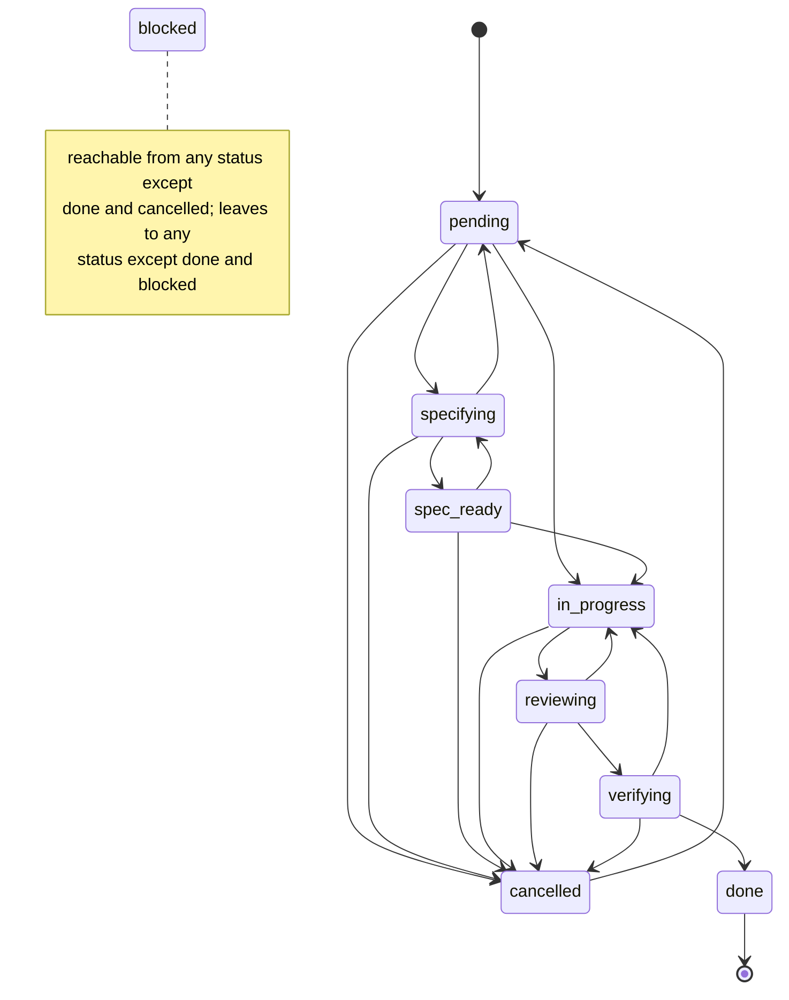

# Implementation - docs-for-newcomers (item 23)

## What changed

Two new wiki pages introduce the cast: `The-Agents.md` covers the five agents (purpose, when
each runs via the orchestrator's dispatch table, what each writes, what each must never do,
who records which ledger row, with pass separation as the thesis and a scratch-repo
transcript of the gate refusing an implementer-only close), and `Skills-and-Playbooks.md`
covers the twelve skills and seven playbooks in scannable tables, the router's route table,
the two paths in plain words, and a five-rung evidence-ladder summary that links State-Files
for depth. A readability layer went onto every existing content page: a 2-4 sentence
plain-language opening inserted after each H1, before the untouched first paragraph. Two
mermaid diagrams were added: a `stateDiagram-v2` of the lifecycle in How-A-Work-Item-Flows
above the transition table (blocked drawn as a note, per the recorded decision), and a
request-to-merged flowchart placed on Home.md (recorded decision: Home is the entry page and
the flow is orientation; Skills-and-Playbooks stays tables-first and links to it) and reused
verbatim in the README. The README top gained a plain paragraph and a "The map" section
(concept table plus the flowchart) before "Where this comes from". Home's pages table, the
README documentation table and `_Sidebar.md` list both new pages. Publishing-the-Wiki's
first `sd` rewrite command was extended with the two new filenames and both publish commands
were re-run on fresh copies to re-earn the page's "run and diffed" claim. No existing
sentence was reworded, split or deleted; every existing page is a pure addition except that
one re-run command.

## Files

- `docs/wiki/The-Agents.md` (new, 163 lines)
- `docs/wiki/Skills-and-Playbooks.md` (new, 107 lines)
- `docs/wiki/Home.md` (+28: opening paragraph, "One request, end to end" section, 2 table rows)
- `docs/wiki/How-A-Work-Item-Flows.md` (+41: opening paragraph, state diagram with lead-in)
- `docs/wiki/Getting-Started.md` (+6, opening paragraph only)
- `docs/wiki/The-Story.md` (+4, opening paragraph only)
- `docs/wiki/Gates-and-Hooks.md` (+6, opening paragraph only)
- `docs/wiki/The-CLI.md` (+5, opening paragraph only)
- `docs/wiki/State-Files.md` (+5, opening paragraph only)
- `docs/wiki/Status-Line.md` (+5, opening paragraph only)
- `docs/wiki/Publishing-the-Wiki.md` (+8 -2: opening paragraph, sd file list extended)
- `docs/wiki/_Sidebar.md` (+2)
- `README.md` (+40: plain paragraph, "The map" section with table and flowchart, 2 doc-table rows)
- `.mstack/progress/current.md`, `.mstack/decisions.tsv` (2 implement-phase rows)

## Commands

The item's verification field, run at the editing tree (full log in the session scratchpad,
`verify-run.log`):

```
$ npm test
Ran 276 tests across 15 files. [49.87s]        # bun test
ℹ tests 276                                    # node --test
ℹ pass 276
ℹ fail 0
$ npm run typecheck
> bunx --bun tsc --noEmit                      # no diagnostics
$ ./bin/mstack lint-plugin .
PASSED - 0 failures, 0 warnings
$ node scripts/check-doc-links.mjs README.md docs/wiki/*.md
91 relative links checked, 0 broken
chain exit: 0
```

Mermaid validation. The method: a script that imports `STATUSES` and `TRANSITIONS` from
`src/lifecycle.ts` and asserts the state diagram's edge set equals `TRANSITIONS` exactly
(blocked excluded, drawn as a note), all nine statuses appear verbatim, there is no
`in_progress -> done` edge, and both flowchart copies parse against mermaid arrow/node
grammar, stay under 15 nodes, and are byte-identical. Script at
`<scratchpad>/mermaid-check/check.ts`, run with bun:

```
$ bun <scratchpad>/mermaid-check/check.ts
ok    state diagram edges match TRANSITIONS exactly (18 edges, blocked via note)
ok    no in_progress -> done edge
ok    all 9 statuses appear verbatim
ok    Home.md: flowchart parses, 9 nodes, 10 edges
ok    README.md: flowchart parses, 9 nodes, 10 edges
ok    Home.md and README.md carry the identical flowchart
PASSED
```

Mutation check that the validator can fail (edge injected, then restored):

```
$ # after inserting "in_progress --> done" into the diagram
FAIL  edges in diagram not in lifecycle.ts: in_progress->done
FAIL  diagram has the forbidden in_progress -> done edge
FAILED: 2
mutated exit: 1
$ # after restoring
PASSED
restored exit: 0
```

The-Agents transcripts, produced in a scratch repository by this checkout's `./bin/mstack`
(setup, one item, implementer verdict, forced close, gate red; reviewer verdict, gate
green):

```
$ ./bin/mstack gate      # after the forced close on an implementer-only verdict
[fail]  items closed on a verdict from the pass that wrote the code: greet-flag (only implementer)
        fix: a closing verdict has to come from somewhere other than the implementer; run the verification again from a pass that did not write it
FAILED - 1 failure, 2 warnings
$ ./bin/mstack gate      # after the reviewer row at the same SHA
[ok]    1 closed item(s) carry a ledger verdict
PASSED - 0 failures, 2 warnings
```

Publishing-the-Wiki re-run: both sd commands executed on fresh copies of all fourteen pages
in the scratchpad; the result was compared per file against an independent Python transform
that rewrites links and nothing else:

```
independent transform matches sd output byte for byte
```

Byte-identity of existing content, against pre-edit byte copies:

```
$ diff <byte-copy> <page>   # per page; deletions would show as '<' lines
README.md: +40 -0 · Home.md: +28 -0 · How-A-Work-Item-Flows.md: +41 -0
Getting-Started.md: +6 -0 · The-Story.md: +4 -0 · Gates-and-Hooks.md: +6 -0
The-CLI.md: +5 -0 · State-Files.md: +5 -0 · Status-Line.md: +5 -0
Publishing-the-Wiki.md: +8 -2 (the sd command, re-run) · _Sidebar.md: +2 -0 · _Footer.md: +0 -0
```

Em-dash check over every added line: no matches.

## Acceptance to evidence

Docs item, so acceptance bullets map to checks rather than unit tests.

| Acceptance | Evidence | Rung |
|---|---|---|
| A1: five agents, twelve skills, seven playbooks documented, consistent with `agents/*.md` and `skills/*/SKILL.md` at this commit | `docs/wiki/The-Agents.md` (cast table, dispatch table, per-agent sections, ledger-row table), `docs/wiki/Skills-and-Playbooks.md` (12-skill table, route table, 7-playbook table). Written from the source files read this session; tool lists, report-name grammar and verdict mappings quoted from `agents/*.md`, skill sentences from each `SKILL.md` frontmatter | 2 (content claims traced to source lines); the two embedded gate transcripts are rung 4 |
| A2: lifecycle and request-flow mermaid diagrams that render on GitHub | State diagram in `How-A-Work-Item-Flows.md`, flowchart in `Home.md` and `README.md`. Edge/status match against `src/lifecycle.ts` and grammar checks: validator output above, plus mutation check | 4 for the lifecycle match and syntax well-formedness; **2 for GitHub rendering itself** (GitHub documents mermaid support for these diagram types, but no render was observed on GitHub this session; check on the PR view) |
| A3: every content page and the README top open plain before mechanism, README first screen maps concepts | Opening paragraphs inserted after each H1 on all 10 content pages (diff summary above shows insertions before untouched bodies); README lines 5-10 plain paragraph, "The map" table at lines 19-33 | 2 (structural, verifiable by reading the diffs) |
| A4: pasted output from real `./bin/mstack` runs at the editing commit; existing transcripts unaltered | New transcripts produced in the scratch repo by this checkout's `./bin/mstack` (runs shown above). Unaltered: per-page diffs show zero deleted lines on every page except the re-run sd command | 4 (the runs, and the diff check) |
| A5: check-doc-links and lint-plugin pass; `Home.md` and `_Sidebar.md` list every page | `91 relative links checked, 0 broken`; lint-plugin `PASSED - 0 failures, 0 warnings`; Home pages table and `_Sidebar.md` carry all ten content pages (both new rows added this session) | 4 for the two commands; 2 for the listing |

## The two diagrams, full source

Lifecycle (`docs/wiki/How-A-Work-Item-Flows.md`):



Request flow (`docs/wiki/Home.md` and `README.md`, identical):


## Every change to existing pages, for the no-claim-moved check

No paragraph was split and no existing sentence was reworded or deleted. Every change is a
whole new block inserted at a seam, except the one re-run command:

1. `Home.md`: new opening paragraph after `# mstack`; new section "One request, end to end"
   (flowchart plus one pointer sentence) inserted before "## Where to start"; two rows added
   to the pages table after the How-A-Work-Item-Flows row.
2. `Getting-Started.md`: one new paragraph between the H1 and "This page takes a clean
   repository...".
3. `The-Story.md`: one new paragraph between the H1 and "mstack has two parents.".
4. `How-A-Work-Item-Flows.md`: one new paragraph between the H1 and "A work item is a row
   in..."; one new block (two-sentence lead plus the state diagram) between the nine-statuses
   code block and "The legal transitions, from `TRANSITIONS`...".
5. `Gates-and-Hooks.md`: one new paragraph between the H1 and "The enforcement plane has
   three parts...".
6. `The-CLI.md`: one new paragraph between the H1 and "`bin/mstack` is on `PATH`...".
7. `State-Files.md`: one new paragraph between the H1 and "Everything durable lives in...".
8. `Status-Line.md`: one new paragraph between the H1 and "The status line exists for one
   signal...".
9. `Publishing-the-Wiki.md`: one new paragraph between the H1 and "The files in `docs/wiki/`
   are the wiki."; the first `sd` command's file list gained `The-Agents.md` and
   `Skills-and-Playbooks.md` (the only non-additive edit anywhere, re-run as shown above so
   the page's "run and diffed" claim stays earned).
10. `_Sidebar.md`: two list rows after How-A-Work-Item-Flows.
11. `README.md`: one plain paragraph after the tagline, before the untouched "In practice
    that means three things..."; new "## The map" section before "## Where this comes from";
    two rows in the Documentation table after the How-A-Work-Item-Flows row.

## Honest gaps

- GitHub's actual rendering of the two mermaid blocks stops at rung 2: the syntax is
  validated and the diagram types are GitHub-documented, but no GitHub render was observed
  from this session. Worth one glance at the PR view.
- "A stranger can read it" (A1) is a judgment the reader lens has to make; I wrote it, so my
  claim stops at rung 1 on friendliness.
