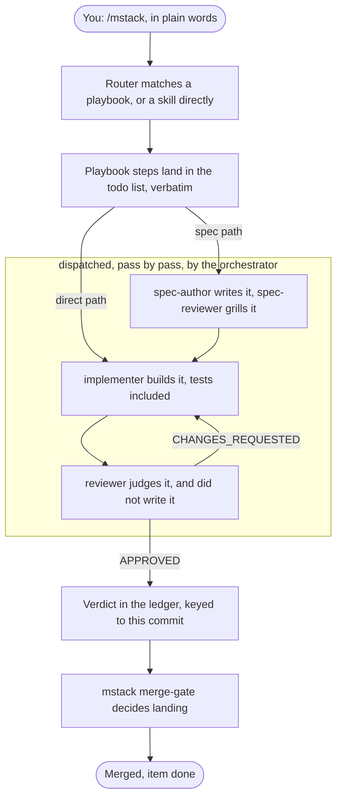

# mstack

mstack makes agent work inspectable. You ask for something in plain words; a router turns
the request into a plan with named steps; agents that cannot approve their own work build
and judge it; and nothing closes until a gate that is code has seen the proof. Everything
the workflow knows lives in files in your repository, so a crashed session, or you, can
always see where things stand.

mstack is a Claude Code plugin for rigorous, verifiable agent workflows: work items live in a
durable store on disk, every claim carries a typed verdict keyed to a commit SHA, and the rules
that must hold are enforced by hooks and gates that are code rather than prose. It is a port of
[pstack](https://github.com/cursor/plugins/tree/main/pstack) by
[Lauren Tan](https://github.com/poteto) (the name follows her convention, `poteto` →
`pstack`, and mstack keeps it), joined to the enforcement machinery of a spec-driven harness
that had been running in production. The judgment came from pstack; the enforcement came
from the harness; what is new is the join.

## One request, end to end

The router and its playbooks are on [Skills-and-Playbooks](Skills-and-Playbooks.md), and the
orchestrator and the agents inside the frame are on [The-Agents](The-Agents.md). One box is
deliberately missing: the session gate, `mstack gate`, is not a step in this flow. The `Stop`
hook runs the fast gate at the end of every turn, and every pass runs `mstack gate` before it
acts, so it can go red at any point in the picture. Both gates are on
[Gates-and-Hooks](Gates-and-Hooks.md).

## Where to start

Read [Getting-Started](Getting-Started.md) and run the commands as you go. It takes a clean
repository from `mstack setup` to a first closed item, and every command block is followed by
the output it actually produced.

If you want to know why the plugin is shaped the way it is before you run anything, read
[The-Story](The-Story.md) first.

## The pages

| Page | What it holds |
|---|---|
| [Getting-Started](Getting-Started.md) | Prerequisites, both install routes, the status line, and a first work item driven end to end, with real output |
| [The-Story](The-Story.md) | pstack and its author, the unnamed harness, where the two agree, where they disagree, and what the port fixed |
| [How-A-Work-Item-Flows](How-A-Work-Item-Flows.md) | The lifecycle and its legal transitions, direct path versus spec path, the decision gate, and the example repo's three seeded items |
| [The-Agents](The-Agents.md) | The five agents: who builds, who judges, which report each one writes, and why nobody approves their own work |
| [Skills-and-Playbooks](Skills-and-Playbooks.md) | The twelve `/mstack` commands, the router's route table, the seven playbooks, and the two paths |
| [Gates-and-Hooks](Gates-and-Hooks.md) | The five hooks and what each one enforces, every check `mstack gate` runs, and the merge gate's decision rules |
| [The-CLI](The-CLI.md) | Every subcommand with a real example and its output, the exit codes, and the verdict enum |
| [State-Files](State-Files.md) | The anatomy of `.mstack/`: state.json fields, ledger and decisions columns, the progress-file disciplines, and the evidence ladder |
| [Status-Line](Status-Line.md) | Wiring it into settings.json, the stale-verdict signal it exists for, the subagent rows, and the degradation rules |
| [Publishing-the-Wiki](Publishing-the-Wiki.md) | The mechanical route from these files to a live GitHub wiki |

These pages live in the repository under `docs/wiki/` so they can be reviewed like code. They
are the source the GitHub wiki is published from, per
[Publishing-the-Wiki](Publishing-the-Wiki.md).

## The one idea, in three sentences

Claude Code reads a skill into the conversation once and does not re-read it, so a rule that
lives only in prose is a rule the model can drift from. mstack therefore splits the plugin in
two: judgment lives in skills, and anything that must hold for a whole session lives in a hook
or in a gate that is code. Everything else on these pages is that split applied somewhere
specific.
